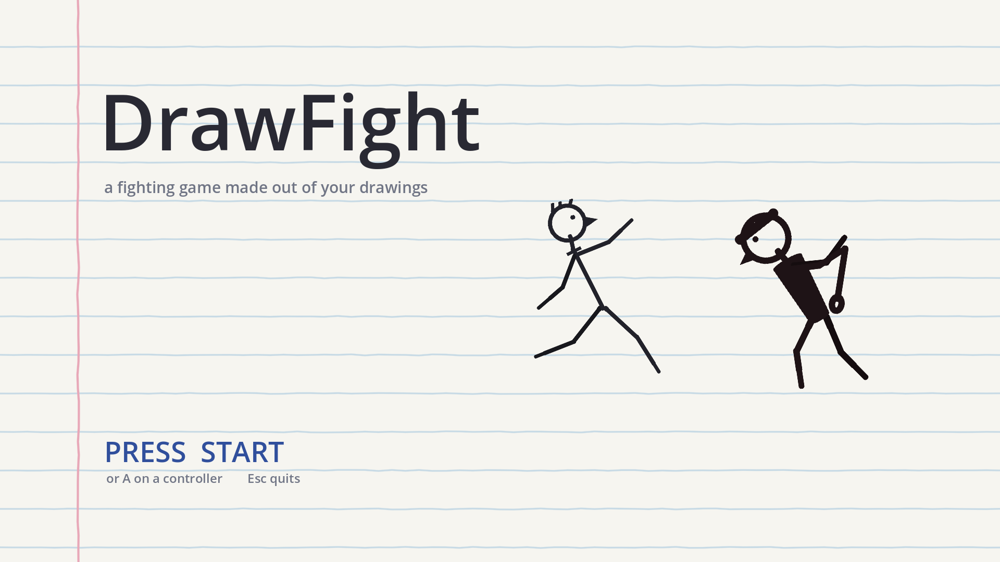
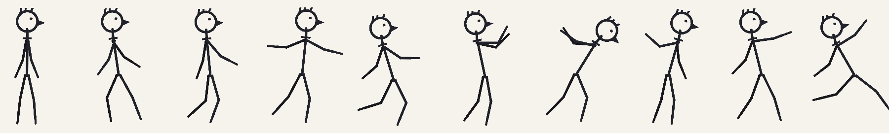
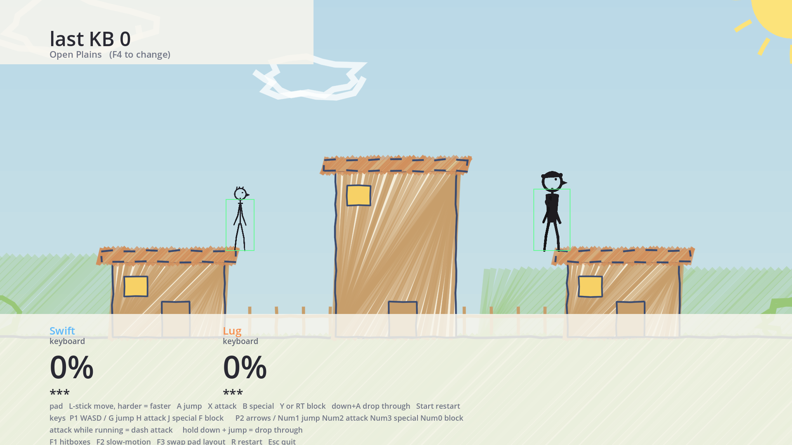

# DrawFight

**A Super Smash Bros.-style platform fighter where every character is a drawing made by a kid.**

You draw a character on paper or on a tablet. It gets cut into pieces, hung on a skeleton, and
put in a fighting game. Then it runs, jumps, and knocks other people's drawings off the screen.



---

## The trick

One drawing, sliced into body parts, animated as a paper puppet:



That drawing was never redrawn, traced or cleaned up. Those are the same pixels, rotated about
their joints — which is the entire point of the project. If a limb is lumpy, the limb is lumpy
in the game.

**Every fighter rigs to the same skeleton**, so the animation library is authored once and
inherited by all of them. Adding a character is an afternoon of cutting up a photo, not a week
of animating. That single decision is what makes the project survivable: if a new drawing took a
weekend to get in the game, a kid would draw three characters and stop.

---

## Status

Playable, and nowhere near finished. Nothing in it has been balanced by anyone who has actually
played it.

| | |
|---|---|
| **Fighting** | percent + knockback + stocks, hitlag, screen shake, DI, ledge grabs, dodges |
| **Moves** | 17 per fighter — a jab combo (length set by weight), 3 tilts, 3 chargeable smashes, dash attack, 5 aerials, 4 specials, each with its own animation |
| **Fighters** | 5 — **Circy**, the first fighter designed by a kid (Elim); **EdgeLord**, a sword fighter drawn by Eric, with placeholder colouring; **DoomBot**, a robot drawn by Eric, waiting on his moves; and two generated stick figures (Flambé and Lugnut) |
| **Stages** | 3 — Fridge Door, Open Plains, City Rooftops |
| **Screens** | title, character select, stage select, match |
| **Input** | Xbox pads (hot-pluggable) and keyboard |
| **CPU** | one basic computer opponent, for playing alone |
| **Sound** | a sound for every attack and hit, the countdown, KOs and menus; menu and battle music — all generated by code |
| **Not yet** | CPU difficulty levels, 3–4 players, the art import tool, results screen, volume settings |

Flambé (Swift) and Lugnut are **scaffolding, not content** — see [`fighters/README.md`](fighters/README.md).
They exist so the engine could be built and played before any real drawing existed, and they get
deleted when real ones land. Circy is the real thing: designed and drawn by Elim, and cut
straight from Elim's drawings without a line redrawn. EdgeLord and DoomBot are drawn by Eric;
EdgeLord plays with stand-in colours and move art until the finished drawings arrive.

---

## Playing it

Download it from **<https://ecec.dev/drawfight/download>** (Windows). It keeps itself up to
date: every time it starts, it checks for a new version and installs it.

## Running it from source

Needs [Godot 4.5.1 **Mono**](https://godotengine.org/download) (the C#/.NET build) and .NET 9.

```sh
dotnet build DrawFight.sln     # ~2s, catches essentially all C# errors
"$GODOT_BIN" --path .          # run it
```

Handy flags — each boots straight to one screen and can screenshot itself:

```sh
"$GODOT_BIN" --path . -- --match --stage=1   # skip the menus
"$GODOT_BIN" --path . -- --parade --shot=70  # every fighter in every animation
"$GODOT_BIN" --path . -- --parade --attacks --shot=70  # every fighter's attacks at the moment they hit
"$GODOT_BIN" --path . -- --shot=120          # screenshot after 120 frames, then quit
```

## Controls

| Xbox pad | |
|---|---|
| left stick | move — **the harder you push, the faster you run** |
| A or Y | jump, double jump |
| X | attack — tap repeatedly for a jab combo; hold a direction for tilts and aerials; **flick** the stick with it for a smash (hold X to charge); while running, a dash attack |
| d-pad + X | a smash attack in that direction, every time — hold X to charge it |
| B | special (+ a direction for all four) |
| LT or RT | block — reduces damage and knockback, never negates it |
| LT/RT + stick | roll, spot dodge, air dodge |
| LB or RB | taunt — a pose and a line; does nothing but show off, and leaves you open |
| hold ↓ | crouch (ducks high attacks); attack from it for a low sweep |
| hold ↓ + A | drop through a soft platform |

Keyboard: P1 arrow keys to move, `A` jump, `Q` attack, `W` special, `S` block. With no second
pad, P2 is the number pad: `8`/`4`/`5`/`6` move, `1` jump, `2` attack, `3` special, `0` block.

In menus, each player presses **A** to join, then drags a cursor with the left stick and presses
**A** to pick; **B** takes a pick back. **QUIT** is on the fighter select screen.

**Playing alone:** press **CPU** in the other player's panel. **CHANGE** cycles the computer's
fighter and **REMOVE** takes it out; a second player pressing A on their own controller takes
the seat back.

In a match, **Start** pauses, with a choice to resume or go back and pick fighters.
Keyboard extras: `F1` hitboxes, `F2` slow motion, `F3` swap pad layout, `F4` cycle stage, `R` restart.

---

## Three ideas the whole codebase rests on

**One skeleton, shared by everyone.** `RigBone` *is* the skeleton. Every fighter has exactly
those bones, so one animation library drives all of them. A drawing's parts are stored in a
canonical orientation — limbs pointing straight down — so a bone rotation of zero means the same
thing for every fighter regardless of the pose it was drawn in.

**Everything is an integer frame count.** The game logic runs at a fixed 60 Hz and no duration
is ever a float in seconds. Startup, active frames, endlag, hitstun, buffers — all frames. That
is what makes moves feel consistent and balance arguments concrete, and retrofitting it would
mean rewriting every move.

**A stage is data, not a renderer.** There is one stage renderer for the whole game. A stage is
a palette, a list of rectangles and a list of props in `StageCatalog.cs`. If adding one seems to
need new drawing code, the data model is wrong.



---

## Adding content

**A fighter** — put its parts and a `rig.json` under `fighters/<name>/`, then add an entry to
`FighterCatalog`. Pick a weight class (Light / Medium / Heavy) and it inherits ten retuned
normal attacks automatically; only the **four specials** are authored per character, because
those come from the kid's own description of what their fighter does.

**A stage** — one entry in `StageCatalog`: a palette, some rectangles, some props. No drawing
code.

**Checking your numbers** — `RegressionChecks` runs on every boot and prints the percent at
which each move starts KOing, by simulating the launch. Read it before and after touching any
knockback number. It has already caught a swing that killed at 50% and a jab that caused 38
frames of hitstun.

---

## Layout

```
scripts/        all the code, flat — engine, rig, stages, screens, tools
scenes/         one 2-line .tscn that attaches GameRoot; everything else is built in code
fighters/       one folder per fighter: source art, sliced parts, rig.json
tools/art/      the generator that made the placeholder stick figures (Python 2.7 + PIL)
tools/audio/    the generators for every sound effect and both music loops (Python 2.7)
assets/         generated sound (assets/sfx/) and music (assets/music/) - never hand-edited
.ai/            design docs — the source of truth for anything design-shaped
for-nephew/     written for a 10-12 year old, not for developers
```

### Design docs

`.ai/` is where decisions live, and why. Worth reading before changing anything design-shaped:

- [`project-overview.md`](.ai/project-overview.md) — the pitch and the five pillars
- [`fighting-design.md`](.ai/fighting-design.md) — the combat contract, the knockback formula
- [`art-pipeline.md`](.ai/art-pipeline.md) — how a photo becomes a rigged fighter
- [`art-direction.md`](.ai/art-direction.md) — crayon and marker, and why night is lavender
- [`audio-direction.md`](.ai/audio-direction.md) — how every sound is made, and how loud
- [`character-design.md`](.ai/character-design.md) — a kid's description → a balanced moveset
- [`releasing.md`](.ai/releasing.md) — the download, and how it updates itself
- [`roadmap.md`](.ai/roadmap.md) — what is built and what is deliberately deferred

---

## For the kids

[`for-nephew/`](for-nephew/) is written for a 10–12 year old: how to draw a fighter so it can
actually be rigged, and a character sheet to fill in. There is a nicer illustrated version of
the guide [here](https://claude.ai/artifact/DmdTZS491FFJs28Cj8g5qL).

The most important question on the character sheet is **"what is your fighter TERRIBLE at?"** —
asked before anything is built. A kid designing a fighter will make it fast *and* strong *and*
tough; a kid asked what it is bad at will cheerfully invent a weakness, because weaknesses are
characterful and they know that already. That question does the balance work and is disguised
as the fun one.

---

## A note on the art

This repository is public, but the drawings in it are not up for grabs.

Any real child's artwork in `fighters/` belongs to the child who drew it. **Circy is Elim's** —
the character, the name, the moves, and every drawing under `fighters/circy/` — and is shared
here so people can see the game, not for reuse. Please don't copy the drawings into anything
else.

The same goes for **EdgeLord and DoomBot, which are Eric's** - the drawings under
`fighters/edgelord/` and `fighters/doombot/`. Flambé (Swift) and Lugnut are
script-generated and carry no such claim. No licence has been chosen for the
code yet; until one is, the default applies and it is all rights reserved.
